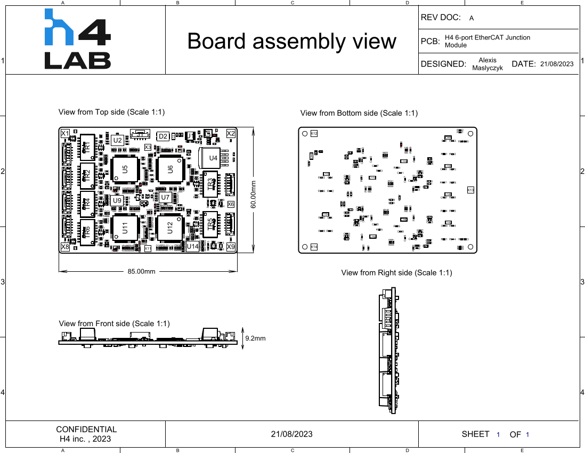
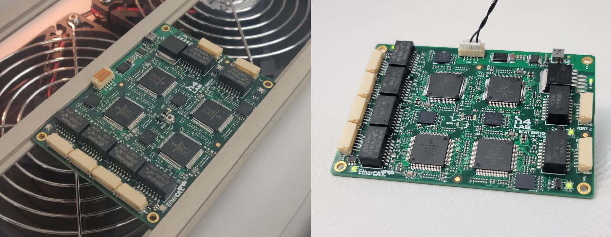
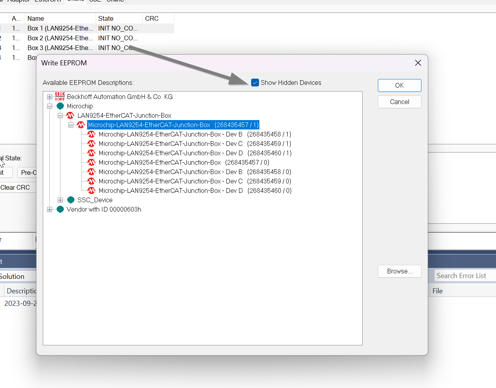
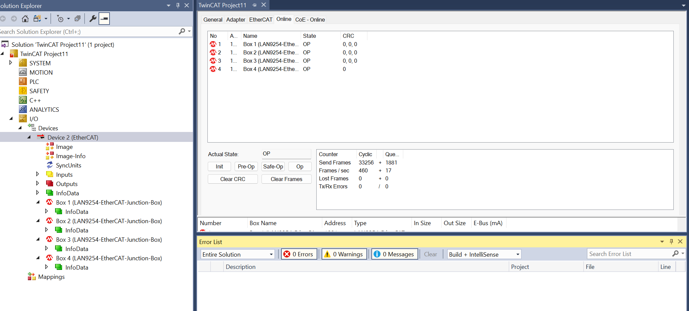
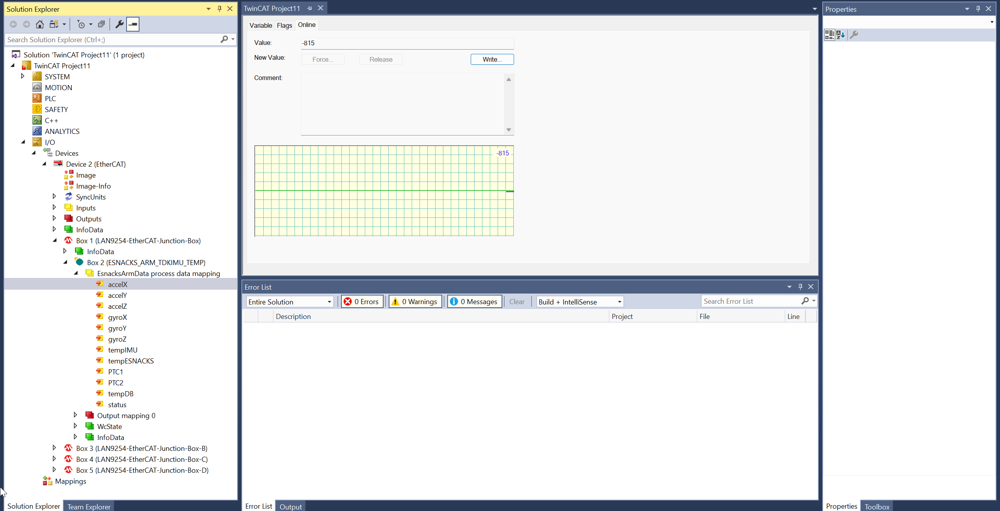

This repository replicates our internal Circuit Board Design Files repository, but only displays a portion of the material and documentation we intend to make public.
This project is  is licensed under the BSD 3-Clause "New" or "Revised" License.

H4 EtherCAT 6-port Module using Microchip LAN9254
===
# Overview
The H4 6-port EtherCAT junction enables communication between six multiple EtherCAT devices in a network. The design integrates four LAN9254 chips capable of supporting 100Mbps (100BASE-TX) operation.
It can serve as a central point in a daisy chain topology or branch topology.
With its small form factor (60x85mm), the board is designed for seamless integration into robotic solutions.
This board was specifically designed for embedded robotic applications, with the primary goal of replacing commonly available off-the-shelf modules that tend to be bulky, such as the BECKHOFF EP6228 or the OMRON GX-JC03 / JC06.  

### Hardware release (production files)
* Rev 1.0 Initial version (20 August 2023)

### Features
* Up to 6 EtherCAT ports (JST-GH connector)
* 4x LAN9254 Slave Controller with Integrated Ethernet PHYs
* Run and Error LEDs for each slave controller
* Reset switch (also available externaly)

### Electrical specifications
* Wide Input Voltage: 6-60V (reverse polarity protected)
* Operating temperature: -40degC to +85degC (Industrial)
* Protection against electrostatic discharges (ESD) 

### Mechanical dimensions
* 60mm x 85mm (2.36" X 3.35")
* Height≈9.1mm

### Files
Each board has its own folder containing the source files (schematic and layout on Altium), output files (gerber, BOM and pick and place for manufacturing), documents (schematic and layout in PDF files), images, configuration files for etherCAT etc.

### Board Assembly
Board Rev 1.0 assembled:

### Software Configuration
The first step is to flash all the LAN EEPROM with the right configuration.
You can follow the steps provided by Microchip:
https://ww1.microchip.com/downloads/aemDocuments/documents/UNG/ProductDocuments/SupportingCollateral/6-Port-EtherCAT-Coupler-EVB-LAN9254-DIGIO-50003263.pdf

ETHERCAT DEVICE
1. Connect the boards and power on the boards.
2. Connect the Port 0 (Board 1) to the PC running TwinCAT using the Ethernet cable.
3. Download the configuration file (ESI) from the product page and copy the LAN9254-EtherCAT-Junction-Box configuration file to TwinCAT directory TwinCAT\3.1\Config\Io\EtherCAT.
4. Once the new project is created, in the Project Solution pane, expand the I/O section and right-click Devices. Click Scan to scan the EVBs.
5. After scanning the device, the dialog box may appear. Click OK in the dialog box if it appears.
6. Check if the window appears with your Device check box ticked. This is an indication that the Ethernet cable is properly connected to the board and the PC. Click OK.
7. Click Yes when prompted with “Scan for boxes” in a dialog box
8. The Activate Free Run dialog box appears. Click Yes to Activate Free Run.
9. In the Solution Explorer pane, find and click your Device (EtherCAT). The TwinCAT Test_EtherCAT Coupler tab appears. Four boxes should be present in the Online tab, as there are four ESCs. The ESCs are not in “OP” state because the EEPROM has to be updated with the respective configuration file.
10. Select and right click Box 1 (ESC 1). Click EEPROM Update and then OK toload the new configuration into the EEPROM.
11. In the Write EEPROM dialog box, the LAN9254-EtherCAT-Junction-Box configuration file can be found.
Note: Make sure step 3 is completed, otherwise the configuration file cannot be found.
12. Select the Show Hidden Devices check box in the Write EEPROM dialog box. As Box 1 (ESC 1) is selected in step 10, select Microchip-LAN9254- EtherCAT-Junction-Box, and click OK.

13. Repeat steps 10 to 12 for Devices 2, 3, and 4 but selecting the following:
Device 2 Box 2 (ESC 2) Microchip-LAN9254-EtherCAT-Junction-Box-Dev-B
Device 3 Box 3 (ESC 3) Microchip-LAN9254-EtherCAT-Junction-Box-Dev-C
Device 4 Box 4 (ESC 4) Microchip-LAN9254-EtherCAT-Junction-Box-Dev-D
14. After loading all the EEPROMs with respective configuration files, rescan the device. Right-click Device 3 (EtherCAT) and click Scan.
15. Once the above steps are done correctly, all the devices states should read as “OP”.

### EtherCAT Slave testing
1. Connect one EtherCAT slave to one port of the boards and power on the boards.
2. After scanning the device, the dialog box may appear. Click OK in the dialog box if it appears.
3. The Activate Free Run dialog box appears. Click Yes to Activate Free Run.
4. You should now see your EtherCAT slave connected:

The board underwent comprehensive testing and functioned as anticipated within the specified wide input voltage range. All EtherCAT ports were individually tested with a variety of EtherCAT slaves, including the TI F28388, LAN9252, and Beckhoff ET1100, among others.

NOTE: We don't have the setup and equipment to test the ESD protections. We selected the transient protection diode for Ethernet with the parameters listed:
i) Working voltage at least to be 3.3V.
ii) Clamping voltage at 1A Ipp parameter has to be within absolute maximum voltage rating limit (5V)
iii) Capacitance parameter to be < 5pF loading.
iv) Leakage current to be < 1 μA.
For more detailed information please refer the following Transient protection App note in the below link
http://ww1.microchip.com/downloads/en/AppNotes/00002157B.pdf