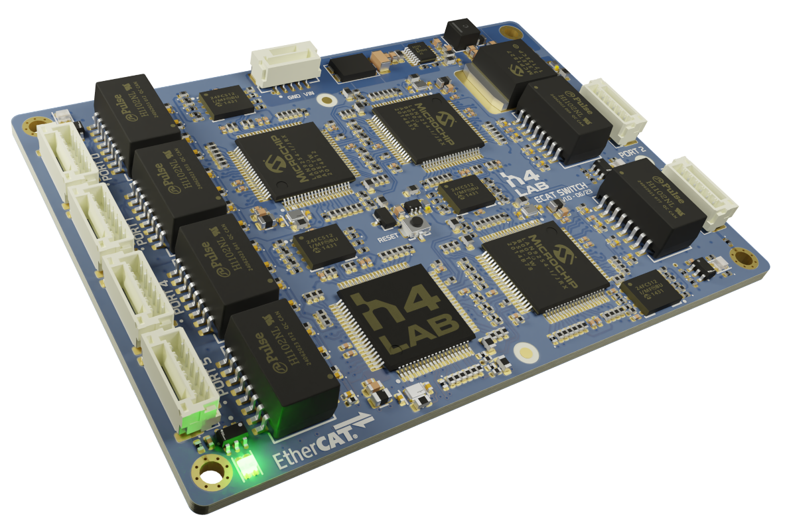
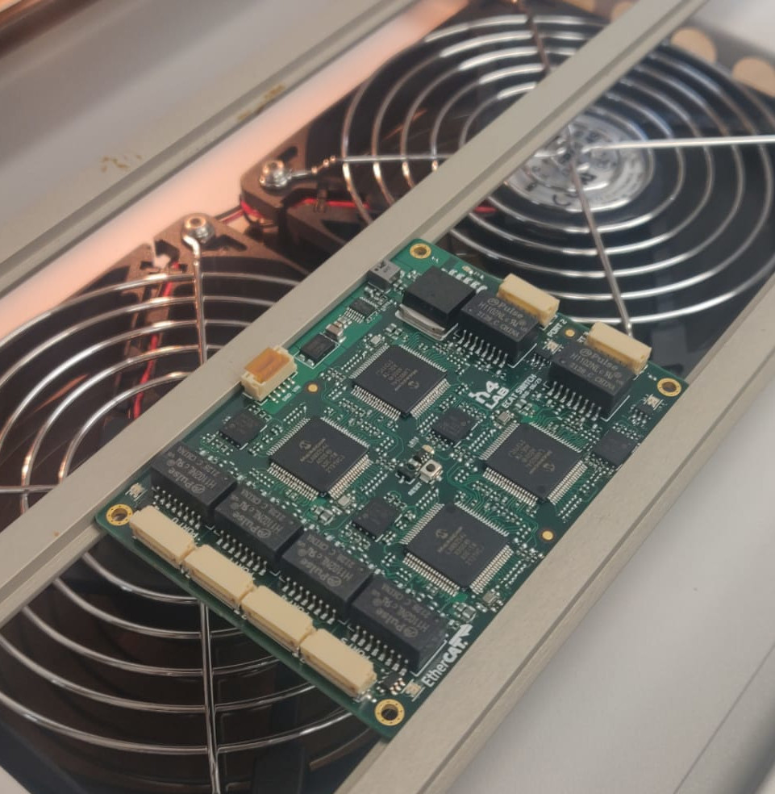
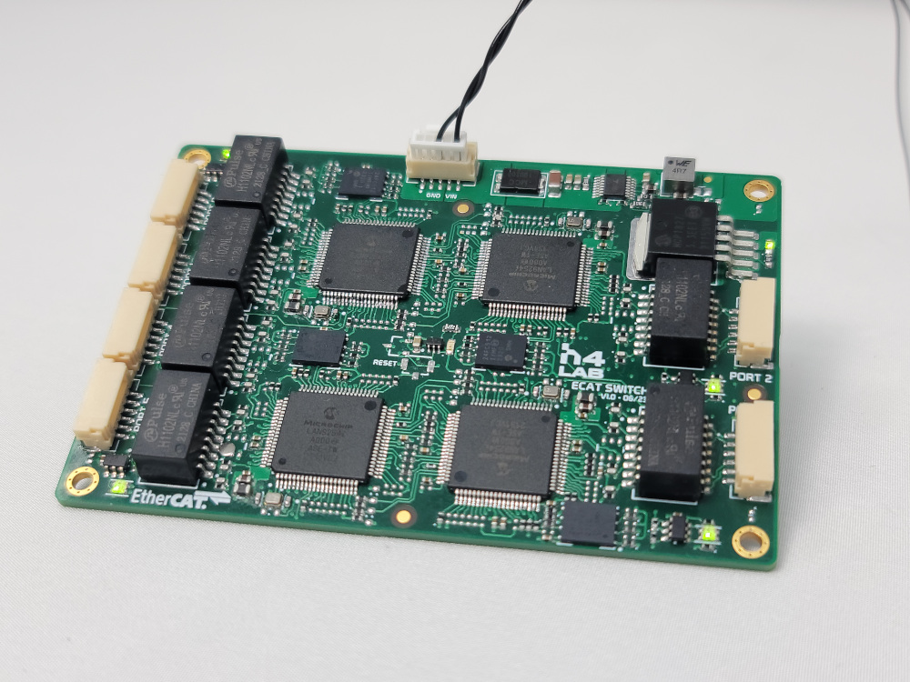
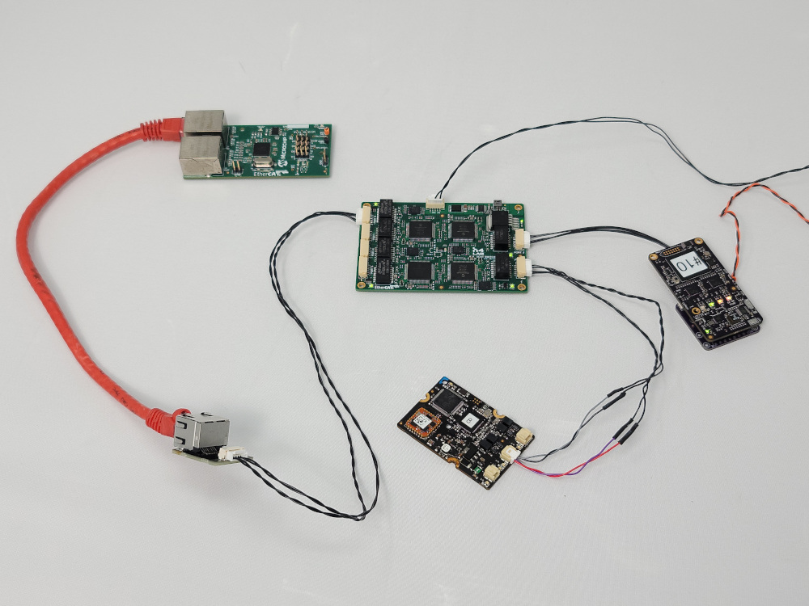

This repository replicates our internal Circuit Board Design Files repository, but only displays a portion of the material and documentation we intend to make public.
This project is  is licensed under the BSD 3-Clause "New" or "Revised" License.

H4 EtherCAT 6-port Module using Microchip LAN9254
===
# Overview
The H4 6-port EtherCAT junction enables communication between six multiple EtherCAT devices in a network. The design integrates four LAN9254 chips capable of supporting 100Mbps (100BASE-TX) operation.
It can serve as a central point in a daisy chain topology or branch topology.
With its small form factor (60x85mm), the board is designed for seamless integration into robotic solutions.
This board was specifically designed for embedded robotic applications, with the primary goal of replacing commonly available off-the-shelf modules that tend to be bulky, such as the BECKHOFF EP6228 or the OMRON GX-JC03 / JC06.  

### Hardware release (production files)
* Rev 1.0 Initial version (20 August 2023)

### Features
* Up to 6 EtherCAT ports (JST-GH connector)
* 4x LAN9254 Slave Controller with Integrated Ethernet PHYs
* Run and Error LEDs for each slave controller
* Reset switch (also available externaly)

### Electrical specifications
* Wide Input Voltage: 6-60V (reverse polarity protected)
* Operating temperature: -40degC to +85degC (Industrial)
* Protection against electrostatic discharges (ESD) 

### Mechanical dimensions
* 60mm x 85mm (2.36" X 3.35")
* Height≈9.1mm

### Files
Each board has its own folder containing the source files (schematic and layout on Altium), output files (gerber, BOM and pick and place for manufacturing), documents (schematic and layout in PDF files), images, configuration files for etherCAT etc.

### Testing
Board Rev 1.0 assembled:

The fully was fully tested and worked as expected.

